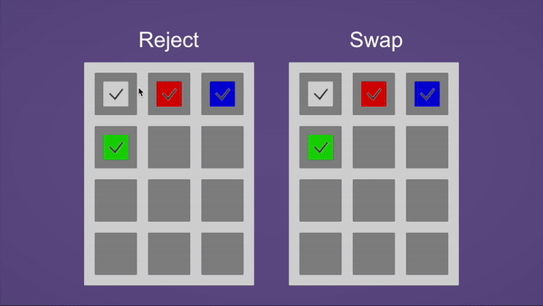

# Simple-Item-Slot-UI

## Overview

Simple Item Slot UI is a lightweight Unity package for creating draggable item slots in your UI. This package provides two core components—`ItemSlot` and `DraggableItem`—that let you drag items between slots and optionally swap them if a slot is already occupied. It’s designed to be minimal and straightforward, making it easy to integrate or modify for your own projects.



------

## Installation

### 1. Git or Package Manager

1. Clone or download this repository.
2. In your Unity project, open the **Package Manager**.
3. Click the `+` button in the upper-left corner, select **Add package from disk...**, and browse to the `Packages/SimpleItemSlotUI` folder in the cloned repository.
4. Click **Add** to install.

Alternatively, you can add this repository as a Git URL:

1. Open the **Package Manager**.

2. Click the `+` button, select **Add package from git URL...**.

3. Paste the repository URL (for example):

   ```
   https://github.com/kwan3854/Simple-Item-Slot-UI.git?path=/Packages/SimpleItemSlotUI
   ```

4. Click **Add**.

## Repository & Sample

This repository may include a sample scene demonstrating how to set up and use the two main components (`ItemSlot` and `DraggableItem`). To try it out:

1. Clone this repository.
2. Open the Unity project containing the package.
3. Open the sample scene under the `Samples` or `Example` folder (if provided) to see how the item slots and draggables are configured.

------

## Usage

### 1. Setting up in the Editor

1. **Create a UI slot**:
   - Add an empty `GameObject` (e.g., `Slot1`) to your Canvas.
   - Attach the `ItemSlot` component to it.
   - Choose a `SlotBehaviour` in the Inspector:
     - **Reject**: The slot will reject an incoming item if it’s already occupied.
     - **Swap**: The slot will swap the existing item with the dragged one.
2. **Create a draggable item**:
   - Add a UI element (e.g., an `Image`) to your Canvas.
   - Attach the `DraggableItem` component to it.
   - In the Inspector, assign a Parent to move the object to when dragging (Can be None).
     - If none is assigned, it defaults to the root of the scene or the root canvas.
3. **Place the draggable item inside the slot**:
   - In the Hierarchy, make the `DraggableItem` a child of an `ItemSlot`.
4. **Adjust visuals** (optional):
   - Modify the `Image` on the `DraggableItem` for your desired look.
   - Set up additional UI elements (like borders, texts, etc.) under the same hierarchy if needed.

Once set up, you can click and drag the item to another `ItemSlot`. If both slots have `SlotBehaviour = Swap`, the two items will swap places.

------

## Script Reference

### 1. `ItemSlot` Component

- **Namespace**: `SimpleItemSlotUI.Runtime`
- **Implements**: `IDropHandler`
- Key Property:
  - `behaviour` (`SlotBehaviour` enum): Determines how the slot handles incoming items.
    - `Reject`: Ignores drops if the slot is already occupied.
    - `Swap`: Swaps existing item with the incoming item if occupied.
- Key Method:
  - `OnDrop(PointerEventData eventData)`: Triggered when a draggable item is dropped onto the slot.
  - `SwapItems(Transform currentItem, DraggableItem draggableItem)`: Handles swapping items between slots.

### 2. `DraggableItem` Component

- **Namespace**: `SimpleItemSlotUI.Runtime`
- **Implements**: `IBeginDragHandler`, `IDragHandler`, `IEndDragHandler`
- Key Property:
  - `SnapTo`: Internal property that determines where the item should return (parent slot) after dragging ends.
- Key Methods:
  - `OnBeginDrag(PointerEventData eventData)`: Sets the initial parent to `SnapTo` and moves the item to a temporary parent (such as a root canvas) so it can be dragged freely.
  - `OnDrag(PointerEventData eventData)`: Updates the position of the item to follow the pointer.
  - `OnEndDrag(PointerEventData eventData)`: Returns the item to `SnapTo` and re-enables raycast targeting.
- Notes:
  - Automatically searches for `MaskableGraphic` components (e.g. `Image`) to toggle `raycastTarget` on drag events.

------

## License

*(Add your license information here, e.g., MIT License, or remove this section if not applicable.)*

This project is licensed under the [MIT License](https://chatgpt.com/g/g-p-67bc8f88e20881919620c7535611751c-simple-item-slot-ui/c/LICENSE).